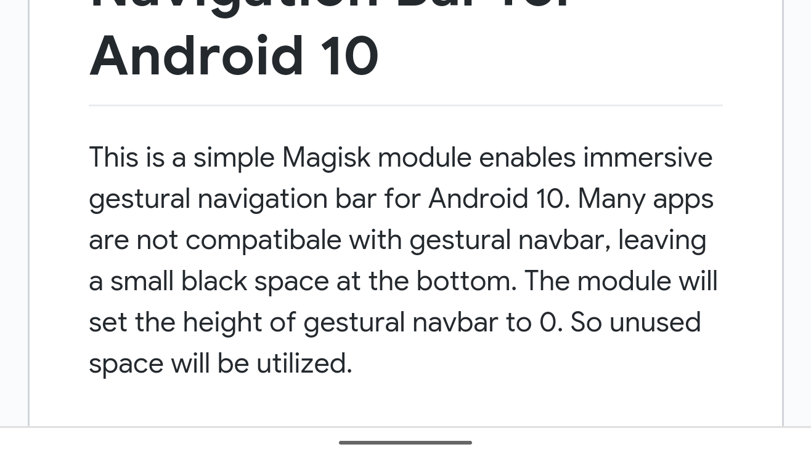
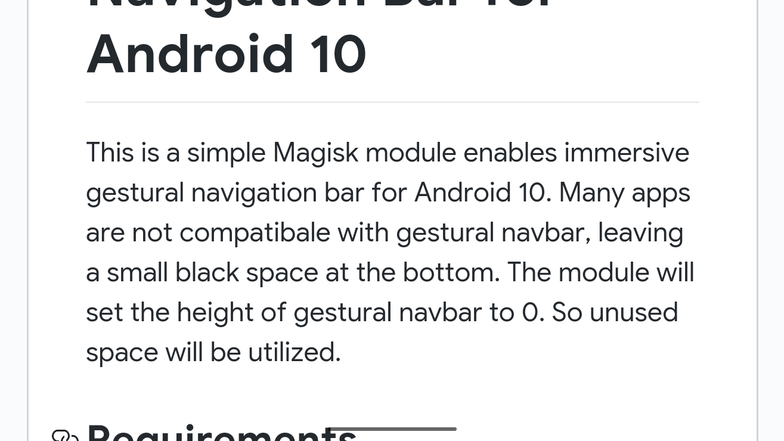

# Immersive Gestural Navigation Bar for Android 10

**Note:** Not compatible with OnePlus or MIUI devices. It's only tested on AOSP based devices.

This is a simple Magisk module enables immersive gestural navigation bar for Android 10. Many apps are not compatibale with gestural navbar, leaving a small black space at the bottom. The module will set the height of gestural navbar to 0. So unused space will be utilized.

If you want to kill the pill(make the nav bar invisible), you should try [Fullscreen Gesture (Q)](https://github.com/Magisk-Modules-Repo/HideNavBar).

## Screenshots

**Before Install:**

**After Install:**

## Requirements
- Android 10 only
- Magisk 18+

## Installation
1. Flash this module.
2. Reboot.
3. Enjoy immersive gestural navbar!

## Links
- [GitHub](https://github.com/samchugit/Immersive_Gestural_Nav_Bar)
- [Telegram](https://t.me/samuel_chu)

## Changelog
### v1.0
- initial release
